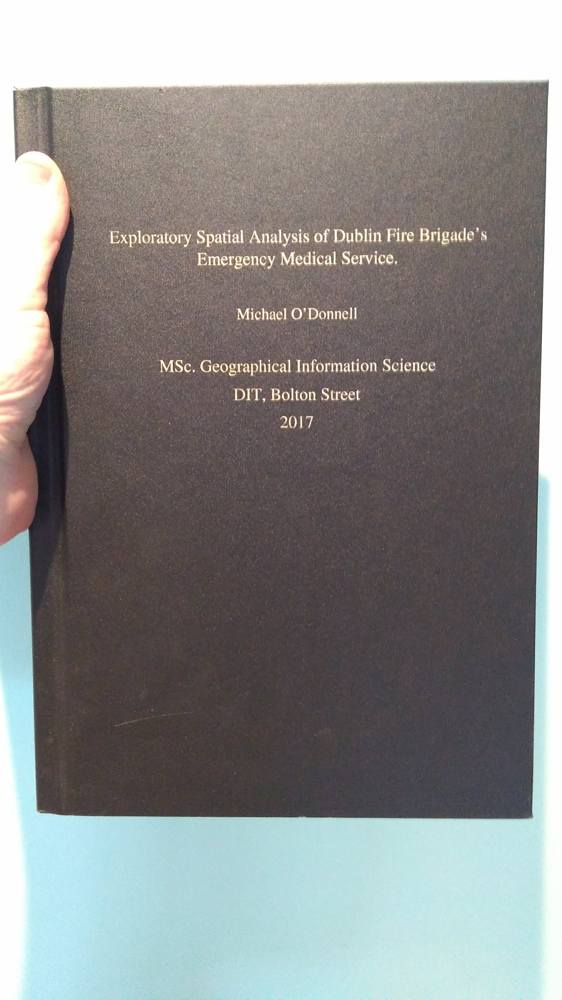

```{r setup, include=FALSE}
knitr::opts_chunk$set(echo = TRUE, cache = TRUE)

#, warning = FALSE, results = 'asis', message = FALSE

library(tidyverse)
library(magrittr)
library(lubridate)
library(sf)
library(leaflet)
library(kableExtra)
library(inspectdf)
library(plotly)
library(scales)

```

# RGeneration RMarkdown Overview

_Hello there!_

My name is **Mick O Donnell** and I will take you through a tour of what RMarkdown can do for your work or research with R.

## So... what is it?

RMarkdown is an extremely powerful, yet simple to implement micro-language which enables the mixing of analysis code with a narrative which can explain the code.  

You've probably heard of html or xml... (Bonus points for knowing what the letters stand for!!!). Well, markdown is a well established simple text layout language, which has been built upon to create a language which is tailored for use with R.

It was first developed in 2012 by **Yihui Xie** - you can find a lot more detail on the language in his [book](https://bookdown.org/yihui/rmarkdown/) which outlines how you can author documents such as books or dissertations in RMarkdown. Xie now works for RStudio and has developed an amazingly versatile and extensible system, which spans production of all forms of communication, from websites (_blogdown_) and slides to dissertations and journal articles.

The best way to learn it is to give yourself a project to do with it. I wrote an MSc Thesis in it, and while it was a challenge, it very much suited the research, as I wanted to achieve a reproducible analysis workflow - and I got to learn a new skill...!




It is fully integrated with RStudio, with options to create all forms of RMarkdown media, buttons to action the various commands needed to "knit" a markdown document, and allowing customisation of the type of output you want. While RMarkdown is a native web format, and using it to knit a html document means you can exploit all the power of web (javascript based) packages such as leaflet and plotly, it is also possible to output to pdf and even Microsoft Word formats.

Key advantages:  
* ability to leverage version control capabilities of git etc. 
* lightwight file-type, that when compiled produce rich documents.
* human readable - even as a raw document

One thing I would highly advise is to print out and laminate the handy cheatsheets available [here](https://www.rstudio.com/resources/cheatsheets/). They're invaluable and should be on the desk of any R user.

## Analysis

For the purpose of exposing some of the features and convenience of RMarkdown for reproducible analysis, we will look at a recently released dataset - the Valuation Office released as open data information relating to commercial property for several counties around Ireland. You can learn more about this [here](https://www.valoff.ie/en/open-data/api/).

We will import the data directly as a csv table from the api - the query string is obtained via the query engine on the Valutaion Office website. You can specify several different parameters such as the county, what fields you want to drawdown and what categories of business you are interested in. I have specified all the data for Dublin City Council.


```{r download-data}
if (!file.exists("data/valoff_dcc.csv")) {
  valoff_dcc <- read_csv("https://api.valoff.ie/api/Property/GetProperties?Fields=*&LocalAuthority=DUBLIN%20CITY%20COUNCIL&CategorySelected=OFFICE%2CFUEL%2FDEPOT%2CLEISURE%2CINDUSTRIAL%20USES%2CHEALTH%2CHOSPITALITY%2CMINERALS%2CMISCELLANEOUS%2CRETAIL%20(SHOPS)%2CUTILITY%2CRETAIL%20(WAREHOUSE)%2CNO%20CATEGORY%20SELECTED%2CCENTRAL%20VALUATION%20LIST%2CCHECK%20CATEGORY%2CNON-LIST%2CNON-LIST%20EXEMPT&Format=csv&Download=true")

  valoff_dcc %>% write_csv("data/valoff_dcc.csv")
} else valoff_dcc <- read_csv("data/valoff_dcc.csv")

valoff_dcc %<>% 
  mutate(prop_num = as.character(`Property Number`)) %>% 
  select(-`Property Number`) %>% 
  select(prop_num, everything())
```


This results in a table with `r dim(valoff_dcc)[1]` rows and `r dim(valoff_dcc)[2]` columns. It might be helpful to inspect the data.

### Inspect Data

```{r inspect-data}
str(valoff_dcc)
valoff_dcc %>% inspect_cat()
```

So we have a column which serves as a Property Identifier, some columns with geographical info (Local Authority, County, Address, X ITM and Y ITM which are coordinate values) as well as information which describes the category of use (Category and Uses, Floor Use), the area (Area) and valuation attributed to the record (Nav per M2 and Nav).

Lets have a look at the first 20 records... I'm using the `knitr::kable()` function in conjuction with `kableExtra()` which allows customisation of table options. This is ideal for html output, but causes some issues with pdf output, if I recall correctly - some styling options are only available for html. A lot more detail on customisation of `kableExtra()` available [here](https://cran.r-project.org/web/packages/kableExtra/vignettes/awesome_table_in_html.html). `kableExtra` uses applies the twitter bootstrap theme to html tables, with oodles of customisation. 

```{r inspect-top_20}
valoff_dcc %>% head(20) %>% kable() %>% kable_styling(bootstrap_options = "striped", full_width = T)
```

So, as we can see, we have multiple properties per row - can anyone guess what each row might represent? 

```{r inspect-details}
valoff_dcc %>% 
  select(prop_num, Valuation, Category, Uses) %>% 
  distinct(prop_num, .keep_all = TRUE) -> rates_properties # 20306

rates_properties %>% 
  head(50) %>% 
  kable() %>% 
  kable_styling(bootstrap_options = c("striped", "hover"), full_width = T)
```

There are `r dim(rates_properties)[1]` different properties listed for Dublin City Council. Let's see how the categorical variables breakdown...

```{r inspect-property-details}
rates_properties %>% 
  summarise(average_RV = mean(Valuation),
            total_RV = sum(Valuation),
            number_of_properties = n()) %>% 
  kable()%>% 
  kable_styling(bootstrap_options = c("striped", "hover"), full_width = T)

rates_properties %>% 
  count(Uses, sort = TRUE) %>% 
  head(50) %>% 
  kable() %>% 
  kable_styling(bootstrap_options = c("striped", "hover"), full_width = T)

rates_properties %>% 
  count(Category, sort = TRUE) %>%  
  head(50) %>% 
  kable() %>% 
  kable_styling(bootstrap_options = c("striped", "hover"), full_width = T)

rates_properties %>%
  count(Category, Uses, sort = TRUE) -> category_use_table

category_use_table %>%  
  head(50) %>% 
  kable() %>% 
  kable_styling(bootstrap_options = c("striped", "hover"), full_width = T)
```

As can be seen, the principal category is "Office", the principal use is "OFFICE (GEORGIAN / VICTORIAN)" which might be expected for the Dublin City Council area.

### Valuation by Category

 Let's investigate whether the valuation of a property might be related to the category of use of the property. In order to do this we will have to control for the overall area of the property, so we will need to add the area accross all rows for the property. Before we do this, there is a bit of data cleaning needed...  
* Off-licenses are treated differently - filter out
* Car-spaces are treated differently - filter out
* there are some negative values - treat these as positive values
* remove NA floor values
* anything with an area values of 1 / -1 seems to be treated differently - filter out

> note that I use the `%<>%` assignment pipe operator in the next section - more on this at [R for Data Science](https://r4ds.had.co.nz/pipes.html)
 
```{r area-munging}
valoff_dcc %>% 
  filter(!(Area == 1.0 | Area == -1.0 | Area == 0)) %>% # remove illogical Area values
  filter(!`Floor Use` %in% c("CAR SPACES (NO. OF)")) %>% # remove car space rows
  filter(!is.na(`Floor Use`)) %>% # remove NA values in Floor Space
  mutate(Area = Mod(Area)) %>% 
  select(prop_num, Valuation, Area, Category, x = `X ITM`, y = `Y ITM`) -> munged_valoff_areas # convert negative values of Area to positive

# next we sum the area values accross the property with a group process...
munged_valoff_areas %>% 
  group_by(prop_num) %>% 
  summarise(mean_val = mean(Valuation), 
            total_area = sum(Area),
            Category = first(Category),
            x = mean(x), 
            y = mean(y),
            num_areas = n()) -> val_by_cat_area

# add a column to represent the valuation per area
val_by_cat_area %<>% # note use of assignment pipe
  mutate(val_per_area = mean_val / total_area)
```

### Plotting Valuation vs Area

The next step is to plot the data. First we'll do a bog standard ggplot, with a scatter of valuation versus total area, coloured by Category. We need to use log scales for both area and valuation..

```{r plot-valuation-vs-total-area}
val_by_cat_area %>% 
  filter(mean_val > 0) %>% # remove the few 0 values in mean_val
  ggplot(aes(total_area, mean_val)) +
  geom_point(aes(color = Category)) +
  scale_x_log10(labels = number_format()) + # number format from scales is for nive labels
  scale_y_log10(labels = number_format()) +
  labs(y = "Valuation",
       x = "Total Area")
  
```

The beauty of RMarkdown is that you can leverage the full range of interactive html widgets that R supports. One of these is [plotly](https://plotly-r.com/index.html), which has a cool function called `ggplotly` which allows you to pass in a ggplot object and generate an interactive plot for you. Let's have a look...

> Note: I have thinned out the data set using `sample_frac()` to remove some of the load from the html parser

```{r}
# lets pull back some of the data we had before, such as the address..
val_by_cat_area  %>% 
  left_join(valoff_dcc %>% select(prop_num, c("Address 1", "Address 2", "Address 3"))) %>% 
  mutate(add1 = `Address 1`,
         add2 = `Address 2`,
         add3 = `Address 3`) -> val_by_cat_area_w_address

# put the above dataframe into the ggplot object as above
val_by_cat_area_w_address %>% 
  filter(mean_val > 0) %>% # remove the few 0 values in mean_val
  sample_frac(0.2) %>% # filter for 20% of the data to reduce load on html parser
  ggplot(aes(total_area, mean_val)) +
  geom_point(aes(color = Category, Address1 = add1, Address2 = add2, Address3 = add3)) +
  scale_x_log10(labels = number_format()) + # number format from scales is for nive labels
  scale_y_log10(labels = number_format()) +
  labs(y = "Valuation",
       x = "Total Area") -> val_area_scatter

ggplotly(val_area_scatter,
         tooltip = c("Address1", "Address2", "Address3"))
```

As you can see, the ability to incorporate an interactive chart in a document is a very useful feature.

### Mapping the Data

Lets look at mapping the information.

The web mapping library `leaflet` is a very neat way to efficiently plot data on a map. The coordinates we have have been supplied in the projected coordinate system ITM95, specific to Ireland. We will reproject these to WGS84 as leaflet expects the data in latitude and longitude form [see here](https://rstudio.github.io/leaflet/projections.html). We will use the `sf` package to assist us.

```{r munging-map-data}
val_by_cat_area_w_address %>% 
  st_as_sf(coords = c("x", "y"), crs = 29902) -> val_sf

val_sf %>% 
  st_transform(4326) %>% 
  st_coordinates() %>% 
  as.data.frame() -> wgs84_coords

val_by_cat_area_w_address %>% 
  bind_cols(wgs84_coords) %>% 
  rename(lng = X,
         lat = Y) %>% 
  filter(lng > -7,
         lat > 53) %>% 
  sample_frac(0.1) -> val_off_for_mapping

factpal <- colorFactor(topo.colors(10), val_off_for_mapping$Category)

leaflet(val_off_for_mapping) %>% 
  setView(lng = -6.25, lat = 53.35, zoom = 11) %>%
  addTiles() %>% 
  addCircles(color = ~factpal(Category),
             popup = paste0(
               "Category:", 
               val_off_for_mapping$Category,
               "<br>",
               "Address1:", val_off_for_mapping$add1, "<br>",
               "Address2:", val_off_for_mapping$add2, "<br>",
               "Address3:", val_off_for_mapping$add3, "<br>",
               "Valuation:", val_off_for_mapping$mean_val))
```

## Conclusion

I hope this has helped to illustrate some of the power available with RMarkdown.